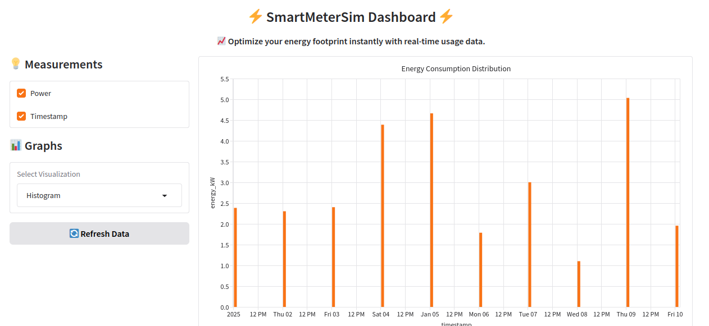
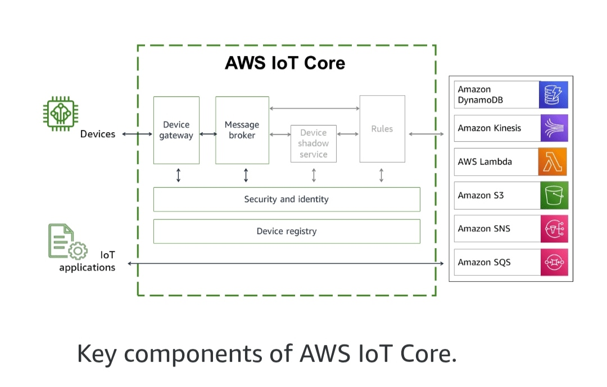

# ⚡ SmartMeterSim

[](https://huggingface.co/spaces/afondiel/smartmetersim)
<!-- <p style="text-align: center;"> </p> -->
<p style="text-align: center;"> </p>

## Overview
**SmartMeterSim** is an IoT smart meter simulator for real-time energy monitoring, enabling cloud integration with AWS IoT Core and Interactive dashboard for real-time data visualization. It serves as a foundation for real-world applications such as smart grid and home automation.

### **Features**
- **Simulated Smart Meter**: Publishes real-time energy data  
- **AWS IoT Core Integration**: Secure MQTT.v5 communication  
- **Dashboard**: Live visualization of energy consumption  
- **Scalable Architecture**: Can integrate with real smart meters device 

### **Real-world Applications**
- **Smart Grid**: Grid monitoring, energy analytics
- **Industrial IoT(IIoT)**: IoT energy metering in factories
- **Home Automation**: Integration with smart home systems
- **EV Charging**: Energy usage tracking for EV charging stations

## **Project Structure**
```
📂 SmartMeterSim/
├── 📂 auth/                  # Device cert, key, ca, policy files (gitignored)
├── 📂 data
│   ├── smart_meter_data.csv   # Energy meter data
├── 📂 src
│   ├── mqtt_publisher.py      # Simulates a smart meter & sends data to AWS IoT
│   ├── mqtt_subscriber.py     # Receives & processes real-time meter data 
├── 📂 dashboard
│   ├── gradio_app.py           # Live visualization
│   ├── streamlit_app.py        # Real-time visualization
└── 📂 config
    └── aws_iot_config.json    # AWS IoT credentials (endpoint, topic, devide Id ...)
``` 

## 🔧 **Setup & Installation**

### Prerequisites
- Python 3.7+
- AWS Account with AWS IoT Core access

### Steps 

1. **Clone the repository**  

```bash
git clone https://github.com/afondiel/SmartMeterSim.git
cd SmartMeterSim
```
2. Create a virtual environment (Recommended)
```bash
python3 -m venv .smsenv
source .smsenv/bin/activate
```

3. **Install dependencies**  
```bash
pip install -r requirements.txt
```

### **Set up AWS IoT Core & Credentials**



1️⃣ **Using AWS Management Console** 

1. Go to AWS IoT Core -> Connect (Make sure you're connected to AWS IoT) 
```bash
ping <your-aws-iot-account>-ats.iot.<region>.amazonaws.com
```
2. Create a new **Thing** named `smartMeter01` -> Next
3. Choose a platform and device SDK (e.g.: Linux and Python)   
4. Download connection kit -> Next 
5. Instead of 'Run connection kit' -> unzip and copy into `auth/` folder

- Upate your `smartMeter01-Policy.json`and replace all the default config with the following:

```json
{
    "Version": "2012-10-17",
    "Statement": [
        {
            "Effect": "Allow",
            "Action": [
                "iot:Connect",
            ],
            "Resource": ["arn:aws:iot:YOUR_REGION:YOUR_AWS_ACCOUNT_ID:connect/${client_id}"]
        },
        {
            "Effect": "Allow",
            "Action": [
                "iot:Publish",
                "iot:Receive",
                "iot:PublishRetain"
            ],
            "Resource": ["arn:aws:iot:YOUR_REGION:YOUR_AWS_ACCOUNT_ID:topic/smartmeter/data"]
        },
        {
            "Effect": "Allow",
            "Action": [
                "iot:Subscribe"
            ],
            "Resource": ["arn:aws:iot:YOUR_REGION:YOUR_AWS_ACCOUNT_ID:topicfilter/smartmeter/data"]
        }
    ]
}
```
Go back to AWS IoT Core and update the thing policy json file and set the new version as "ACTIVE" 
 
2️⃣ **Install all at once using AWS IoT CLI**

Run the script:
```bash
cd resources/tools/scripts
chmod +x setup_aws_iot.sh
./setup_aws_iot.sh
```
For Windows user you can run each instruction starting by `aws <command>...` inside your cmd/PS (If you encounter any problem, please raise an issue)

- If you haven't AWS IoT CLI installed yet, check out this [guide](https://github.com/afondiel/awesome-aws-iot-edge-cli).

Finally:

- Update `config/aws_iot_config.toml` with your AWS settings.
```bash
cp aws_iot_config_temp aws_iot_config.json  # Create a copy
nano aws_iot_config  # Edit and add your credentials
``` 

## Usage

1️⃣ **Run the Smart Meter Simulator**  

Run in this order: `subscriber > publisher`

Subscriber: connects and receives data from AWS IoT MQTT Broker

```bash
  python3 src/mqtt_subscriber.py \
    --endpoint <YOUR_AWS_ENDPOINT> \
    --rootCA <ROOT_CA_PATH> \
    --cert <CERT_PATH> \
    --key <KEY_PATH> \
    --logFile <YOUR_LOG_FILE_PATH> \
    --clientId <CLIENT_ID> \
    --topic <TOPIC>
```
- Publisher: connects and sends device data to the AWS IoT MQTT Broker 

```bash
  python3 src/mqtt_publisher.py \
    --path <CSV_PATH> \
    --endpoint <YOUR_AWS_ENDPOINT> \
    --rootCA <ROOT_CA_PATH> \
    --cert <CERT_PATH> \
    --key <KEY_PATH> \
    --clientId <CLIENT_ID> \
    --delay <DELAY> \
    --topic <TOPIC> 
```

2️⃣ **Start the Dashboard**

[](https://huggingface.co/spaces/afondiel/smartmetersim)

- Gradio:

```bash
  python3 dashboard/gradio_app.py \
    --logFile <YOUR_LOG_FILE_PATH>
```

- Streamlit:

```bash
streamlit run dashboard/streamlit_app.py (TBD)
```

## Security
- TLS Encryption for MQTT Communication  
- AWS IoT Policies for Controlled Access
- Environment Secrets for Credential Protection  

## Contributing 

Contributions to SmartMeterSim are welcome! Please refer to the project's GitHub repository for contribution guidelines.

## Future Roadmap
1. IoT Smart Meter Simulator (Current Stage)
2. Scaling & Cloud-to-Edge Transition
3. Real Smart Meter Integration (in your software stack)

## Contact

Feel free to reach out to me on [LinkedIn](https://linkedin.com/in/afonso-diela), if you have any questions. I'll be glad to help!

